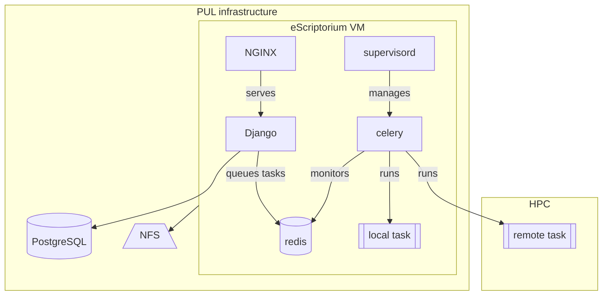
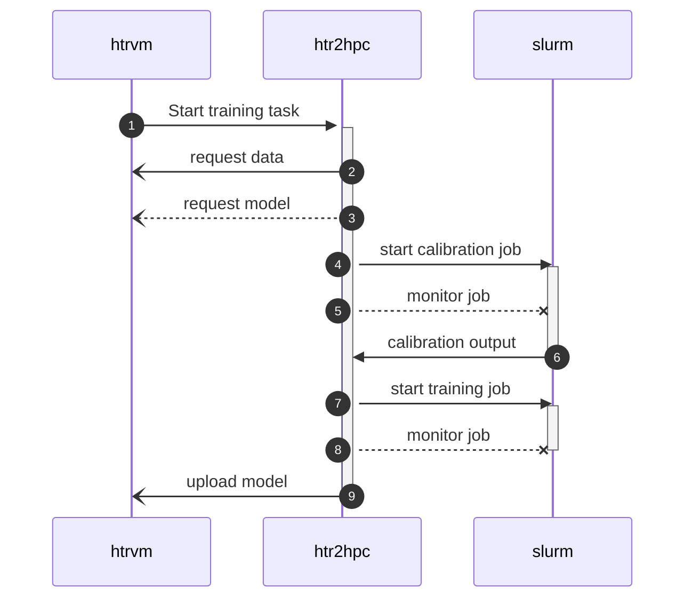

# HTR2HPC

This repository is associated with the [HTR2HPC](https://cdh.princeton.edu/projects/bringing-htr-to-the-hpc/) research project sponsored by the Center for Digital Humanities at Princeton. The project goal is integrating the [eScriptorium handwritten text recognition (HTR) software](https://gitlab.com/scripta/escriptorium) with high performance computing (HPC) clusters and task manage.

> [!WARNING]
> This is experimental code for local use and assessment.

______________________________________________________________________

## Table of Contents

- [Installation](#installation-and-usage)
- [Architecture and Flow](#architecture-and-flow)
- [License](#license)

## Installation and usage 

This package can be installed directly from GitHub using `pip`:

```console
pip install git+https://github.com/Princeton-CDH/htr2hpc.git@main#egg=htr2hpc
```

[`pucas`](https://github.com/Princeton-CDH/django-pucas) is a dependency of this package and will be included when you install this package.

Import htr2hpc settings into the deployed escriptorium local settings. It must be imported *after* escriptorium settings so that overrides take precedence.

```python
from escriptorium.settings import *
from htr2hpc.settings import *
```

This adjusts the settings as follows:

- Adds to `INSTALLED_APPS` and `AUTHENTICATION_BACKENDS` and provides a basic `PUCAS_LDAP` configuration to enable Princeton CAS authentication; configures `CAS_REDIRECT_URL` to use the escriptorium `LOGIN_REDIRECT_URL` configuration (currently the projects list page) and sets `CAS_IGNORE_REFERER = True` to avoid behavior where successful CAS login takes you back to the login page
- Sets `ROOT_URLCONF` to use `htr2hpc.urls`, which adds `pucas` url paths to the urls defined in `escriptorium.urls`
- Adds `htr2hpc/templates` directory first in the list of template directories, so that any templates in this application will take precedence over eScriptorium templates; currently used for customizing the login page to add Princeton CAS login
- Sets `EXPORT_FILE_RETENTION = 168` (hours) as the default retention period for user export files

### Optional settings

The following settings can be overridden in your local settings file:

- `EXPORT_FILE_RETENTION`: Number of hours to retain user export files before they are eligible for cleanup by the `cleanup_exports` management command. Defaults to `168` (1 week). Set to `0` to disable automatic cleanup entirely.

See [DEPLOY NOTES](DEPLOY_NOTES.md) for instructions on creating a new release and deploying it to the server with cdh-ansible.

### Configure CAS authentication

To fully enable CAS, you must fill out configurations for CAS server url and PUCAS LDAP settings in the local settings of your deployed application.

```python
from escriptorium.settings import *
from htr2hpc.settings import *

# CAS login configuration
CAS_SERVER_URL = "https://example.com/cas/"

PUCAS_LDAP.update(
    {
        "SERVERS": [
            "ldap2.example.com",
        ],
        "SEARCH_BASE": "",
        "SEARCH_FILTER": "(uid=%(user)s)",
        # other ldap attributes as needed
    }
)
```

## Architecture and Flow


### Deployment

This architecture diagram shows how the eScriptorium instance was deployed on Princeton hardware during the testing phase.




For simplicity, we omit the second VM and load balancer; the two VMs are provisioned and deployed in the same way, and use shared PUL and HPC resources.

### Remote training flow

This sequence diagram shows the flow of operations between eScriptorium instance, htr2hpc installation on the HPC system, and Slurm.

The task is triggered via ssh, then training data and optionally a model are retrieved via REST API. The htr2hpc training task uses a
two-job workflow with a preliminary calibration job before requesting second training job with resources and time requested based on the results of the calibration job.




## License

`htr2hpc` is distributed under the terms of the Apache 2 license.
